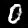
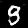
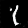
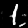
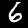
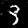
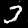
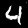

# DCGAN in C++

A implementation of a Deep Convolutional Generative Adversarial Network [(DCGAN)](https://arxiv.org/abs/1511.06434) written in C++. This project was done towards learning C++ and some of its tools. It trains a Generator and Discriminator based on the MNIST dataset on CPUs. The code was inspired by the PyTorch tutorial on the C++ framework [PyTorch C++ Tutorial](https://docs.pytorch.org/tutorials/advanced/cpp_frontend.html).

## Results

As the GAN trains, the Generator learns to map a 100-dimensional latent noise vector into handwritten digits. Below is the progression of the generated samples across training steps:

<div align="center">
  
  
  
  
  
  
  
  
  
  
</div>
<p align="center">
  <em>Samples from the Generator from Epoch 1 (left) to Epoch 10 (right).</em>
</p>

## Prerequisites

To build and run this project, your system needs:
* **C++ Compiler** supporting C++20 (GCC/Clang)
* **CMake** (>= 3.10)
* **LibTorch** (The PyTorch C++ API)
* **OpenCV** (For saving inference tensors as `.png` files)

## Dataset

LibTorch requires the uncompressed, raw MNIST IDX files. Create a `data/` directory and run the `mnist.py` file for dowloading the files.

## Build 

This project uses CMake to handle linking LibTorch and OpenCV. From the root of the project, run:

```bash
mkdir build
cd build
cmake ..
make -j$(nproc)
```

## Usage

After compiling, a `bin/dcgan` binary is created. It takes a command-line argument to choose between training and inference. To train the DCGAN, use:
```bash
./bin/dcgan train
```
This saves training samples and the model checkpoints in `checkpoints/` directory in the root. For inference:
```bash
./bin/dcgan inference
```
Which saves a `inference-sample.png` in `checkpoints/`.
